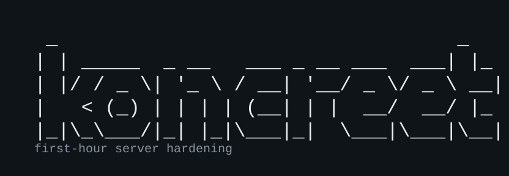

# Koncreet

<p align="center">
  
</p>

First-hour hardening for a fresh Linux VPS. Plain Bash, change plans before it touches anything, and defaults that try not to lock you out.

**Debian 12/13 and Ubuntu 22.04/24.04 only.**

## Install

```bash
curl -fsSL https://github.com/jimididit/koncreet/releases/latest/download/install.sh | sudo bash
sudo koncreet doctor
sudo koncreet
```

Pin a version with `KONCREET_VERSION=0.2.1`. Fallback if you want `main`:

```bash
curl -fsSL https://raw.githubusercontent.com/jimididit/koncreet/main/install.sh | sudo bash
```

Or clone: `git clone https://github.com/jimididit/koncreet.git && cd koncreet && sudo ./koncreet`

## What you get

| Module | |
|--------|--|
| **baseline** | Sudo user + SSH keys, sysctl, swap, journald cap, logrotate/MOTD, timezone/NTP |
| **firewall** | ufw default-deny; real SSH ports first; named services or `8080/tcp` |
| **fail2ban** | systemd backend; ufw bans when ufw is active |
| **updates** | Distro-correct unattended security updates; auto-reboot off unless you ask |
| **ssh** | Disables password auth + root login only if a non-root user already has keys |

Not CIS/STIG, not fleet management, and not public MySQL/FTP without `--public`.

## Usage

```bash
sudo koncreet doctor
sudo koncreet status
sudo koncreet baseline apply --user deploy --pubkey-file ~/.ssh/id_ed25519.pub
sudo koncreet firewall apply https,8080/tcp
sudo koncreet fail2ban apply ssh
sudo koncreet updates apply
sudo koncreet ssh apply
```

Config-driven:

```bash
cp /opt/koncreet/share/koncreet.conf.example ./koncreet.conf
sudo koncreet --dry-run apply -c ./koncreet.conf
sudo koncreet apply -c ./koncreet.conf --yes
```

Flags: `-n` dry-run, `-y` assume yes, `-c` config, `-v` verbose, `-V` version.

`sheriff` is an alias for `fail2ban`. Uninstall: `sudo koncreet uninstall` (add `--purge` to undo drop-ins too).

## If something goes wrong

Keep the session you hardened from open. Test a **new** SSH login before you disconnect.

| Problem | Fix |
|---------|-----|
| Can't SSH after harden | `sudo koncreet ssh undo` |
| Locked out by ufw | Console: `sudo ufw disable` |
| Banned by fail2ban | `sudo koncreet fail2ban unban YOUR.IP` |
| Undo baseline drop-ins | `sudo koncreet baseline undo` (keeps users/swap/timezone) |
| Need the new user password | `cat /root/USER.koncreet-password` |
| Forced password change fails | `chage -d $(date -I) USER` then reconnect with your key |
| Too many authentication failures | `ssh -o IdentitiesOnly=yes -i ~/.ssh/your_key user@host` |

Logs: `/var/log/koncreet.log`. Backups: `*.koncreet.bak`.

## Config

See [`share/koncreet.conf.example`](share/koncreet.conf.example) (`pubkey`, `pubkey_file`, `firewall_ports`, …).

## Development

```bash
bash tests/run.sh
bash tests/smoke-dry-run.sh
shellcheck koncreet install.sh lib/*.sh modules/*.sh
```

Version is in [`VERSION`](VERSION). Tag as `v` + that number for a GitHub Release. See [`CHANGELOG.md`](CHANGELOG.md).

## License

[MIT](LICENSE)
