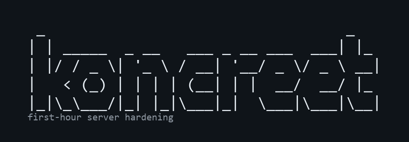

# Koncreet

<p align="center">
  
</p>

First-hour hardening toolkit for a new Linux VPS. Readable Bash, lockout-safe defaults, optional config for power users.

**Supported OS:** Debian 12/13 and Ubuntu 22.04/24.04 only. Other distros are refused with a clear message.

## What it does

| Module | What you get |
|--------|----------------|
| **baseline** | Non-root sudo user + SSH key copy, cloud-safer sysctl, swap if missing, journald size cap, timezone/timesync |
| **firewall** | ufw default-deny; always opens your *real* SSH listen port(s) first |
| **fail2ban** | systemd backend (works without `/var/log/auth.log`), ufw banaction when ufw is active |
| **updates** | Distro-correct `unattended-upgrades` (Debian origins vs Ubuntu/ESM); auto-reboot **off** by default |
| **ssh** | Disable password auth + root login **only** if a non-root user has keys; drop-in + undo |

## What it will not do

- CIS/STIG compliance, fleet management, or HTML audit reports
- Arch, SUSE, Alpine, Fedora/RHEL (yet)
- Open MySQL/FTP to the world without an explicit `--public` / `firewall_public=true`
- Surprise reboots (unless you opt in)

## 60-second start

```bash
git clone https://github.com/jimididit/koncreet.git && cd koncreet
sudo ./koncreet                  # interactive menu - prints a change plan first
```

Power user / automation:

```bash
cp share/koncreet.conf.example ./koncreet.conf
# edit user=, firewall_services=, etc.
sudo ./koncreet --dry-run apply -c ./koncreet.conf   # preview
sudo ./koncreet apply -c ./koncreet.conf --yes         # apply
sudo ./koncreet status
```

## Commands

```text
sudo ./koncreet [flags]                 # menu
sudo ./koncreet status
sudo ./koncreet apply -c FILE [--yes]

sudo ./koncreet baseline apply --user deploy [--timezone UTC]
sudo ./koncreet firewall apply https
sudo ./koncreet firewall apply mysql --public
sudo ./koncreet fail2ban apply ssh
sudo ./koncreet fail2ban unban 1.2.3.4
sudo ./koncreet updates apply            # no auto-reboot
sudo ./koncreet updates apply --reboot --reboot-hour 04:00
sudo ./koncreet ssh check | apply | undo
sudo ./koncreet self-install             # symlink into /usr/local/bin
sudo ./koncreet self-uninstall
```

Global flags: `-n` / `--dry-run`, `-y` / `--yes`, `-c` / `--config FILE`, `-v` / `--verbose`.

`sheriff` is an alias of `fail2ban` (same commands either way).

## Install to PATH

After cloning, optionally symlink into `/usr/local/bin` (does not move the repo):

```bash
sudo ./koncreet self-install     # -> /usr/local/bin/koncreet
sudo koncreet status             # works from any directory
sudo ./koncreet self-uninstall   # remove the symlink only
```

The interactive menu offers this after **Run everything**, and `apply` offers it too (skipped with `--yes`).

## Recovery

Keep your current SSH session open after hardening. Test a **new** connection before you disconnect.

| Problem | Fix |
|---------|-----|
| Cannot SSH after harden | From the open session: `sudo ./koncreet ssh undo` |
| Locked out by ufw | Console/VNC: `sudo ufw disable` or `sudo ./koncreet firewall undo` |
| Banned by fail2ban | `sudo ./koncreet fail2ban unban YOUR.IP` or `sudo ./koncreet fail2ban undo` |
| Need password for new user | From the open root session: `cat /root/USER.koncreet-password`. If login forces a password change and fails: `chage -d $(date -I) USER` then reconnect with your SSH key. |
| Too many authentication failures | Your SSH agent is offering too many keys. Use `ssh -o IdentitiesOnly=yes -i ~/.ssh/your_key bot@host` |

## Config reference

See [`share/koncreet.conf.example`](share/koncreet.conf.example).

| Key | Meaning |
|-----|---------|
| `modules` | Comma-separated: `baseline,firewall,fail2ban,updates,ssh` |
| `user` | Sudo user to create (blank = skip) |
| `firewall_services` | Extra ufw services (e.g. `https,nginx`) |
| `firewall_public` | `true` to allow mysql/vsftpd publicly |
| `fail2ban_services` | Jails to enable (default `ssh`) |
| `ssh_harden` | `true`/`false` |
| `auto_reboot` | Unattended reboot after kernel updates (default `false`) |
| `reboot_hour` | e.g. `04:00` |
| `timezone` | e.g. `UTC` (blank = leave alone) |

## Sysctl notes

`/etc/sysctl.d/99-koncreet.conf` uses **loose** `rp_filter=2` (cloud/VPN friendly), plus `kptr_restrict`, `dmesg_restrict`, and `yama.ptrace_scope=1`. See the file for every knob.

## Logging

Changes are logged to `/var/log/koncreet.log` (or `./koncreet.log` in dry-run / non-root). Overwrites are backed up as `*.koncreet.bak`.

## Output

Terminal output is compact by default: section headers, `[OK]` / `[FAIL]` / `[SKIP]`, and a spinner for long steps. Full command output always goes to the log file.

| Flag / env | Effect |
|------------|--------|
| `-v` / `--verbose` | Stream apt/systemctl output live (still logged) |
| `NO_COLOR=1` | Disable ANSI colors (also off when stdout is not a TTY) |

`self-install` only creates a symlink; the repo (and `lib/`) must stay where they are. Re-run `sudo ./koncreet self-install` after moving the checkout.

## Development

```bash
# Unit tests (bash; no root required)
bash tests/run.sh

# ShellCheck (if installed)
shellcheck koncreet lib/*.sh modules/*.sh
```

## License

MIT - see [LICENSE](LICENSE).
